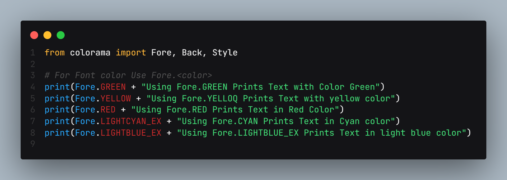
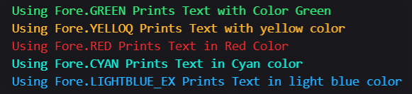
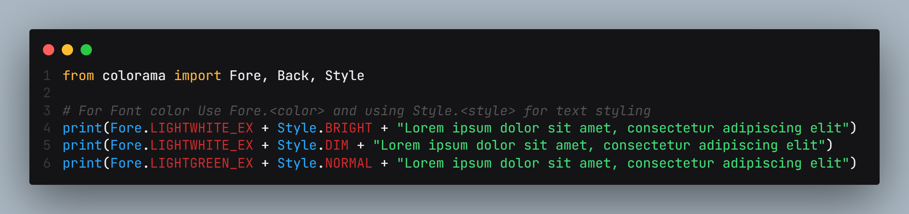
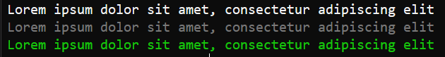
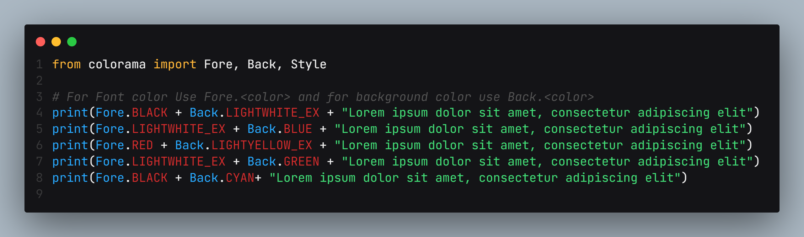
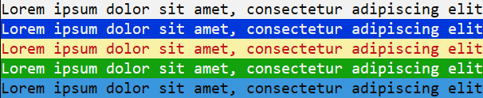

# How to print colored text with background color and text styling?
## So, I've created a repo with a demo showing how to print colored text with a background color and text styling.
```bash
#we will be using colorama
pip install colorama  #installing module
```
## Text Color / Foreground Color
### code

### Output



## Text Styling 
### code

### Output



## Text Background Color
### code

### Output



  
